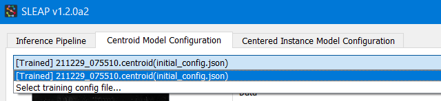
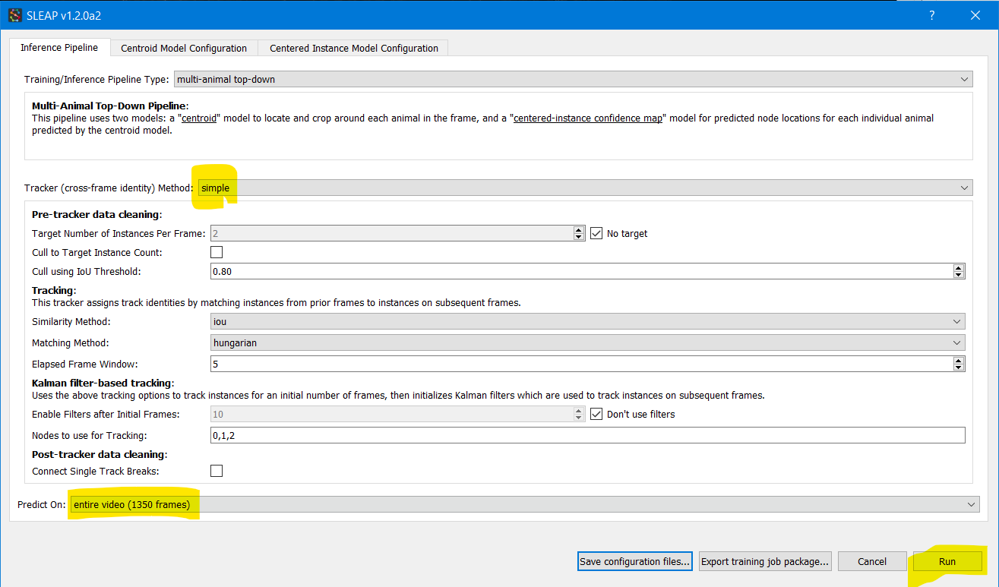
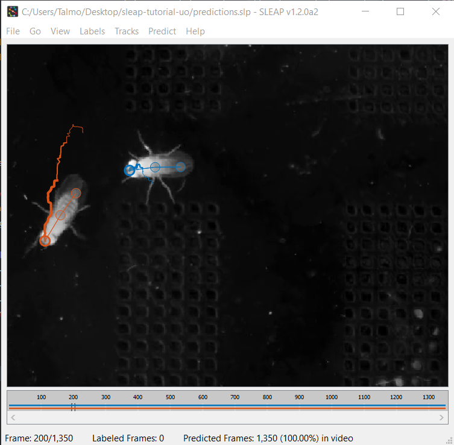

# Activity 2: Tracking and inspecting predictions

**Note:** If you haven't already, make sure you followed the instructions on **[setting up](setup.md)** before you get started.

To do this activity, we'll need a trained model that can predict poses on new data.

If you want to train your own model from scratch, check out [Activity 1](labeling.md).

If you want to use a pre-trained model, download this repository and use the ones in the [`data/models/`](https://github.com/talmolab/sleap-tutorial-uo/tree/main/data/models) folder.

## 1a. Inference through the GUI

Let's start by activating our environment if it is not yet:
```
conda activate sleap_v1.2.0a2
```

And open the SLEAP GUI:
```
sleap-label
```

Let's add a video to predict on by going to **File** → **Add Videos...**. If you downloaded this repository, navigate to the `data` folder and add the provided `fly_clip.mp4`. Save the project to a new file, such as `fly_clip.predictions.slp` by going to **File** → **Save**.

**Tip:** We recommend running inference in a new project so that our predicted and manual labels don't get mixed up. It also helps to have predictions for each video stored separately to facilitate organization and analysis.

Next, let's set up our inference job with our trained models by going to **Predict...** → **Run Inference...** and select the models that you trained from the drop-downs on each tab:



If you don't see the models in the dropdown, click on **Select training config file...** (at the bottom of the drop-down) and browse to the model folder. You can select either `initial_config.json` or `training_config.json` from that folder (it doesn't matter which).


Back in the first panel (**Inference Pipeline**), let's now set up the tracking so we can associate instances across time.

For the tutorial, let's use the `simple` tracker and we'll set the **Predict On** target to the `entire video`. Your GUI should look like this when configured:



Now just click **Run** to start tracking! This may take a few minutes if running on a computer without a GPU.

The results will be automatically imported and you can save the project again to store the results.

## 1b. Inference through the CLI

**Note:** Skip down to the next step if you don't want to learn how to run this using the commandline.

Going through the GUI can be cumbersome, and often we want to run inference at scale on many videos and possibly even on a remote server such as a university cluster.

To address this, we can use the [`sleap-track`](https://sleap.ai/guides/cli.html#sleap-track) commandline interface (CLI).

To track our data with the same configuration as defined in the GUI above, just run this command:

```
sleap-track -m data/models/211229_075510.centroid -m data/models/211229_075510.centered_instance --tracking.tracker simple data/fly_clip.mp4
```

By default, this will save the resulting predictions to `data/fly_clip.mp4.predictions.slp`.

## 2. Inspecting and proofreading the results

Now that we have our predictions, we want to load them up in the SLEAP GUI to check for any tracking mistakes and correct them if necessary.

Open the GUI as you did before and browse to the predictions project, or just call `sleap-label` with the path to the predictions, e.g.:
```
sleap-label "data/fly_clip.mp4.predictions.slp"
```

You'll now see that all frames are labeled and that they have been assigned to distinct tracks:



The raster plots at the bottom denote the frames where the instances of each track were found.

If the instances do not appear to be colored by their track, tweak your visualization settings:

- **View** → **Color Predicted Instances**
- **View** → **Apply Distinct Colors To** → **instances**
- *Optionally:* **View** → **Trail Length** → **200** to show the track behind each instance.

Here we had pretty clean tracking results that do not seem to need any proofreading, but if necessary, you could set the instance tracks manually to correct for errors like swaps.

## 3. Exporting results for analysis

Once we're happy with our tracked project, we can export the predictions to a standalone HDF5 file for analysis.

Unlike `.slp` files, this file can be used without requiring SLEAP to open it, and can be read using standard libraries in R or MATLAB.

From the GUI, we can export this "Analysis HDF5" file from **File** → **Export Analysis HDF5...**.

From the CLI, we can export it using the [`sleap-convert`](https://sleap.ai/guides/cli.html#sleap-convert) command:
```
sleap-convert -o data/predictions.analysis.h5 --format analysis data/predictions.slp
```

## Next steps

- Continue to [Activity 3: Analyzing SLEAP outputs](analysis.md).

- Check out the more detailed [tutorial on tracking and proofreading](https://sleap.ai/tutorials/proofreading.html).

- Learn more about the [tracker parameters and proofreading utilities](https://sleap.ai/guides/proofreading.html).

- Refer to the [`sleap-track` CLI documentation](https://sleap.ai/guides/cli.html#sleap-track).

- Refer to the [`sleap-convert` CLI documentation](https://sleap.ai/guides/cli.html#sleap-convert).
