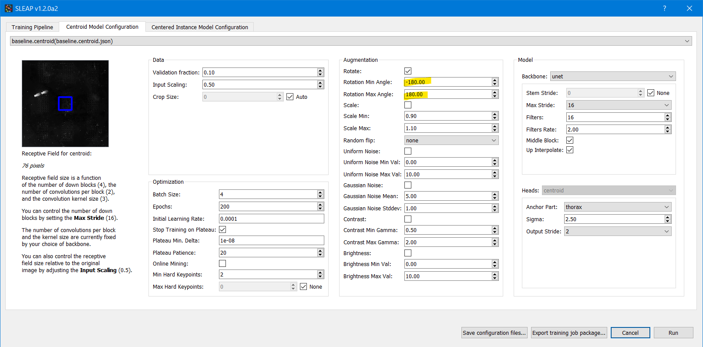
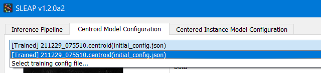
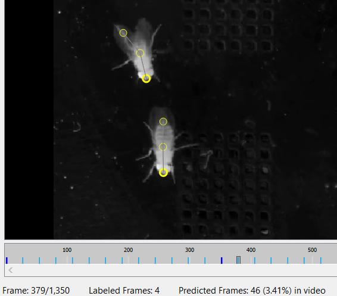

# Activity 1: Labeling and training from scratch

**Note:** If you haven't already, make sure you followed the instructions on **[setting up](setup.md)** before you get started.

If you are having issues with any steps below, you can try using the provided labels project in [`data/labels.v000.slp`](data/labels.v000.slp).

## 1. Start a project

Let's start by opening the terminal and activating our conda environment where we installed SLEAP if it's not already active:
```
conda activate sleap_v1.2.0a2
```

Next, open the SLEAP Labeling GUI with the command:
```
sleap-label
```

Once the window appears, let's start by adding a video to our project by going to **File** → **Add Videos...**. If you downloaded this repository, navigate to the `data` folder and add the provided `fly_clip.mp4`.

You will see a window that looks like this:


Click **Import** to continue.

You will now see the video in the GUI and you can scroll through it by clicking and dragging the seekbar at the bottom.

## 2. Define a skeleton

SLEAP works by example. The first thing we need to define is what body parts ("landmarks") we want to track.

Click on the **Skeleton** panel on the top-right and add a node for each body part and edge for each connection between them.

For our example, we'll just use a simple 3 node skeleton:


[See the tutorial](https://sleap.ai/tutorials/new-project.html#creating-a-skeleton) for more help on creating skeletons.

## 3. Generate suggestions

Suggestions are a **list of frames that you intend to label**. While not necessary, we strongly recommend using the suggestions system in SLEAP to help you along your labeling process.

When labeling a new dataset, we want to minimize the number of images we have to label while maximizing the diversity of poses and appearances represented in the labels. To promote this diversity, suggestions can be generated using image-based features, but a simpler proxy for diversity is sampling with a fixed stride. This ensures you are not labeling consecutive frames in time which have little difference between them.

The suggestions list is also useful as it can serve as an inference target. This will be convenient later on when we want to perform **human-in-the-loop** labeling where we will import our predictions for correction.

Let's start by generating 100 suggested frames using a fixed stride:


This will create a list of frames in the table above and will tell you how many you've labeled:


You can sort this table and double-click on any row to skip to that frame.

## 4. Initial labeling

Now that we're set up, let's start by creating an instance in the first frame. An instance corresponds to a single animal in a single frame. We call them "instances" because they are a *copy* or instantiation of the skeleton we defined.

Right-click anywhere on the image and click **Default** to create a new instance:


Click and drag each circle to position it in the correct location. Repeat this for every animal in the frame.

Once you're done with this frame, click the **Next** button in the suggestions panel or press <kbd>Space</kbd>. Repeat this for 3-4 more frames.

**GUI tips**:
- You can use the mouse wheel or track pad two-finger gestures to **zoom** in and out.
- Hold <kbd>Alt</kbd> while dragging a node to **move the entire instance**.
- Use the scroll wheel while holding <kbd>Alt</kbd> to **rotate the entire instance**.
- You can delete instances by clicking on a node to select it, and pressing <kbd>Ctrl</kbd> + <kbd>Backspace</kbd>.
- If you can't see a body part, it may be preferable to mark is as "not visible" by right-clicking the node. SLEAP will not try to guess the location of these during inference rather than predicting with low confidence.
- Go to **Help** → **Keyboard Shortcuts** to see and modify all the GUI hotkeys.
- Customize the appearance of nodes and instances from the **View** menu.

## 5. Training

Once we've labeled 5-10 frames, we're ready for our first round of training.

Make sure the project is saved by going to **File** → **Save** or pressing <kbd>Ctrl</kbd> + <kbd>S</kbd>.

Open up the training configuration GUI by going to **Predict** → **Run Training...**.

We'll mostly use the default parameters, but make sure to set these options if using our test video (changes highlighted):





The changes here are:
- Set the **anchor part** to the `thorax` which is the most central body part in our skeleton. If not specified, the midpoint of the bounding box is used, which can be significantly less reliable.
- Set the **Predict On** target to the `suggested frames`, which will tell SLEAP to automatically generate predictions on unlabeled frames after training (we'll use this in next section).
- Set the augmentation rotation range to `-180` to `180`. This increases the diversity of the labels by rotating the image and labels. Since this is a video imaged from above, we can rotate to the full range of angles.

Once configured, we're ready to train!

**If you have a GPU on your computer**, all you have to do is hit **Run** on the bottom right and you'll see the training monitor appear within a few seconds:


**If you don't have a GPU**, click **Export training job package...** which will generate a ZIP file with all of the required data and configuration to train on Google Colab.

After saving it, use [this notebook](sleap_colab_workflow.ipynb) to train on Colab or simply click: <a href="https://colab.research.google.com/github/talmolab/sleap-tutorial-uo/blob/main/sleap_colab_workflow.ipynb" target="_parent"></a>

## 6. Correcting predictions

After training the model, we'll want to import the predictions on the unlabeled frames for corrections. This will save us time over labeling from scratch.

If you trained from the GUI, the predictions will have been imported automatically.

If you trained on Colab, you will get a `labels.v000.pkg.slp.predictions.slp` file in the outputs you downloaded. Import this by going to **File** → **Merge into Project...**, select the file ending with `predictions.slp` and click **Finish Merge**.

If you need to re-run inference with a trained model, go to **Predict...** → **Run Inference...** and select the models that you trained from the drop-downs on each tab:



Set the **Predict On** target to the `suggested frames` in the first tab and click **Run** on the bottom right. You can do this even without a GPU.

Once imported, you'll see the predicted instances show up as yellow on your unlabeled frames (if they're colored, uncheck **View** → **Color predicted instances**):



Now, you can just double click on a predicted instance to create a new ground truth instance that you can correct by dragging and dropping.

After doing more labeling, you'll be ready to train a new model with the larger dataset. Repeat this process until the predictions are sufficiently accurate -- this is typically around 100-200 labeled frames, with additional labels improving accuracy with diminishing returns.

## Next steps

- Continue to [Activity 2: Tracking and inspecting predictions](inference.md).

- Learn more about [**model selection and configuration**](https://sleap.ai/guides/choosing-models.html).

- See [this notebook](https://sleap.ai/notebooks/Model_evaluation.html) for more on **model evaluation**.